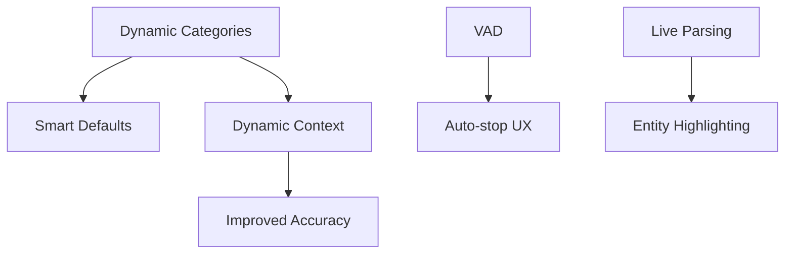

# 🚀 План улучшений системы голосового ввода (Advanced Features)

**Дата создания:** 2026-01-19
**Версия:** 1.0
**Статус:** Planning Phase

---

## 📋 Содержание

1. [Обзор](#обзор)
2. [Архитектурные изменения](#архитектурные-изменения)
3. [Фичи по приоритетам](#фичи-по-приоритетам)
4. [Детальный план реализации](#детальный-план-реализации)
5. [Зависимости и риски](#зависимости-и-риски)
6. [Timeline и оценки](#timeline-и-оценки)
7. [Testing Strategy](#testing-strategy)

---

## 🎯 Обзор

### Текущее состояние

**Функционал:**
- ✅ Базовое распознавание речи (SFSpeechRecognizer)
- ✅ Парсинг сумм, категорий, счетов
- ✅ Pre-compiled regex для производительности
- ✅ ML инфраструктура (CategoryMLPredictor)
- ✅ Rule-based категоризация

**Проблемы:**
- ❌ Hardcoded категории и счета в парсере
- ❌ Требуется ручная остановка записи
- ❌ Нет визуальной обратной связи о распознанных сущностях
- ❌ Простая анимация индикатора записи
- ❌ Наивный выбор счета по умолчанию (первый в списке)
- ❌ Нет динамического контекста для Speech Recognition

### Целевое состояние

**Новый функционал:**
- ✅ Dynamic Categories: живая синхронизация с CategoriesViewModel
- ✅ Automatic Silence Detection (VAD)
- ✅ Real-time Entity Highlighting в UI
- ✅ Modern Siri-like Wave Animation
- ✅ Smart Account Defaults на основе статистики
- ✅ Dynamic Context Injection для Speech Recognition

---

## 🏗️ Архитектурные изменения

### 1. Dependency Injection для ViewModels

**Текущая архитектура:**
```swift
// VoiceInputParser.swift
class VoiceInputParser {
    private let accounts: [Account]          // Статичный массив
    private let categories: [CustomCategory] // Статичный массив
    private let subcategories: [Subcategory] // Статичный массив

    init(accounts: [Account], categories: [CustomCategory], subcategories: [Subcategory]) {
        self.accounts = accounts
        self.categories = categories
        self.subcategories = subcategories
    }
}
```

**Проблема:** Парсер получает snapshot данных при инициализации. Если пользователь добавит новую категорию, парсер не узнает об этом.

**Новая архитектура:**
```swift
// VoiceInputParser.swift
class VoiceInputParser {
    private weak var categoriesViewModel: CategoriesViewModel?
    private weak var accountsViewModel: AccountsViewModel?

    init(categoriesViewModel: CategoriesViewModel, accountsViewModel: AccountsViewModel) {
        self.categoriesViewModel = categoriesViewModel
        self.accountsViewModel = accountsViewModel
    }

    // Динамический доступ к категориям
    private var liveCategories: [CustomCategory] {
        categoriesViewModel?.customCategories ?? []
    }

    // Динамический доступ к счетам
    private var liveAccounts: [Account] {
        accountsViewModel?.accounts ?? []
    }
}
```

**Преимущества:**
- ✅ Всегда актуальные данные
- ✅ Нет необходимости пересоздавать парсер
- ✅ Автоматическая синхронизация

### 2. Voice Activity Detection (VAD) Architecture

**Компоненты:**
```
VoiceInputService
    ↓
SilenceDetector (новый класс)
    ↓
AVAudioEngine → Audio Buffer Analysis
    ↓
Energy Level Calculation → Silence Threshold
    ↓
Callback → Auto-stop recording
```

**Ключевые метрики:**
- **RMS Energy**: среднеквадратичное значение громкости
- **Silence Threshold**: порог тишины (настраиваемый)
- **Silence Duration**: продолжительность тишины для авто-стопа (2-3 сек)

### 3. Real-time Entity Recognition Pipeline

```
Speech Recognition (live)
    ↓
VoiceInputParser.parseLive(partialText)
    ↓
Detected Entities:
    - Amount: NSRange + Confidence
    - Category: NSRange + Confidence
    - Account: NSRange + Confidence
    ↓
UI Update (AttributedString с highlights)
```

### 4. Usage Statistics for Smart Defaults

**Новый класс: `AccountUsageTracker`**

```swift
class AccountUsageTracker {
    // Хранит частоту использования счетов
    private var usageCount: [String: Int] = [:]

    // Хранит последнее использование
    private var lastUsed: [String: Date] = [:]

    // Рассчитывает score на основе частоты и recency
    func getSmartDefaultAccount() -> String?
}
```

**Алгоритм выбора:**
```
Score = (Usage Count × 0.7) + (Recency Factor × 0.3)

Recency Factor:
- Последние 24 часа: 100
- Последние 7 дней: 70
- Последние 30 дней: 40
- Старше 30 дней: 10
```

---

## 📊 Фичи по приоритетам

### Tier 1: Critical (Must Have)

#### 1.1 Dynamic Categories Integration
**Приоритет:** 🔴 HIGHEST
**Сложность:** 🟢 LOW (1-2 часа)
**Impact:** 🔴 HIGH
**Зависимости:** Нет

**Описание:**
Связать VoiceInputParser с live данными из CategoriesViewModel и AccountsViewModel.

**Причина высокого приоритета:**
- Текущий hardcoded список категорий устаревает
- Пользователи не могут использовать свои кастомные категории
- Критично для пользовательского опыта

**Технические детали:**
```swift
// BEFORE:
let parser = VoiceInputParser(
    accounts: accountsViewModel.accounts,      // snapshot
    categories: categoriesViewModel.categories, // snapshot
    subcategories: categoriesViewModel.subcategories
)

// AFTER:
let parser = VoiceInputParser(
    categoriesViewModel: categoriesViewModel, // reference
    accountsViewModel: accountsViewModel      // reference
)
```

**Файлы для изменения:**
1. `VoiceInputParser.swift` - переход на weak references
2. `ContentView.swift` - обновление инициализации парсера
3. `VoiceInputView.swift` - передача ViewModels вместо массивов

---

#### 1.2 Smart Account Defaults
**Приоритет:** 🔴 HIGH
**Сложность:** 🟡 MEDIUM (2-3 часа)
**Impact:** 🟡 MEDIUM
**Зависимости:** Требует статистику транзакций

**Описание:**
Автоматически выбирать наиболее используемый счет вместо первого в списке.

**Алгоритм:**
```swift
func getSmartDefaultAccount(transactions: [Transaction], accounts: [Account]) -> Account? {
    // 1. Группируем транзакции по accountId
    let accountUsage = Dictionary(grouping: transactions) { $0.accountId }

    // 2. Считаем score для каждого счета
    var scores: [String: Double] = [:]
    for (accountId, txs) in accountUsage {
        let usageScore = Double(txs.count) * 0.7

        // Recency bonus
        let recentTxs = txs.filter {
            Calendar.current.dateComponents([.day], from: $0.date, to: Date()).day ?? 999 < 7
        }
        let recencyScore = Double(recentTxs.count) * 0.3

        scores[accountId] = usageScore + recencyScore
    }

    // 3. Возвращаем счет с максимальным score
    guard let topAccountId = scores.max(by: { $0.value < $1.value })?.key else {
        return accounts.first // Fallback
    }

    return accounts.first { $0.id == topAccountId }
}
```

**Файлы для изменения:**
1. Новый файл: `Services/AccountUsageTracker.swift`
2. `VoiceInputParser.swift` - использование smart defaults
3. `VoiceInputConfirmationView.swift` - отображение выбранного счета

---

### Tier 2: Important (Should Have)

#### 2.1 Automatic Silence Detection (VAD)
**Приоритет:** 🟠 HIGH
**Сложность:** 🔴 HIGH (4-6 часов)
**Impact:** 🔴 HIGH
**Зависимости:** Требует работу с AVAudioEngine buffers

**Описание:**
Автоматически останавливать запись после 2-3 секунд тишины.

**Технический подход:**

**Шаг 1: Создать SilenceDetector**
```swift
class SilenceDetector {
    private var silenceThreshold: Float = -40.0  // dB
    private var silenceDuration: TimeInterval = 2.5 // секунды
    private var lastSoundTime: Date?
    private var isSilent: Bool = false

    func analyzeSample(_ buffer: AVAudioPCMBuffer) -> Bool {
        // 1. Calculate RMS energy
        let channelData = buffer.floatChannelData?[0]
        let frameLength = Int(buffer.frameLength)

        var sum: Float = 0
        for i in 0..<frameLength {
            let sample = channelData?[i] ?? 0
            sum += sample * sample
        }

        let rms = sqrt(sum / Float(frameLength))
        let db = 20 * log10(rms)

        // 2. Check if silent
        if db < silenceThreshold {
            if lastSoundTime == nil {
                lastSoundTime = Date()
            }

            let silentFor = Date().timeIntervalSince(lastSoundTime!)
            if silentFor >= silenceDuration {
                return true // Silence detected
            }
        } else {
            lastSoundTime = nil
            isSilent = false
        }

        return false
    }

    func reset() {
        lastSoundTime = nil
        isSilent = false
    }
}
```

**Шаг 2: Интегрировать в VoiceInputService**
```swift
class VoiceInputService {
    private var silenceDetector: SilenceDetector?

    func startRecording() async throws {
        // ... existing code

        silenceDetector = SilenceDetector()

        // Tap audio node для анализа
        let inputNode = audioEngine.inputNode
        let recordingFormat = inputNode.outputFormat(forBus: 0)

        inputNode.installTap(onBus: 0, bufferSize: 1024, format: recordingFormat) { [weak self] buffer, _ in
            guard let self = self else { return }

            // Отправляем в Speech Recognition
            self.recognitionRequest?.append(buffer)

            // Анализируем тишину
            Task { @MainActor in
                if self.silenceDetector?.analyzeSample(buffer) == true {
                    print("🔇 Silence detected - auto stopping")
                    self.stopRecording()
                }
            }
        }
    }
}
```

**Настройки:**
```swift
// VoiceInputConstants.swift
enum VoiceInputConstants {
    // ... existing constants

    // MARK: - Voice Activity Detection

    /// Порог тишины в децибелах (дБ)
    /// Значения меньше этого считаются тишиной
    static let vadSilenceThresholdDb: Float = -40.0

    /// Продолжительность тишины для авто-стопа (секунды)
    static let vadSilenceDuration: TimeInterval = 2.5

    /// Включить/выключить VAD
    static let vadEnabled: Bool = true
}
```

**UI/UX улучшения:**
```swift
// VoiceInputView.swift
@State private var isVADEnabled = VoiceInputConstants.vadEnabled

// Добавить toggle
Toggle("Авто-остановка при тишине", isOn: $isVADEnabled)
    .padding()
```

**Файлы для изменения:**
1. Новый файл: `Services/Audio/SilenceDetector.swift`
2. `VoiceInputService.swift` - интеграция VAD
3. `VoiceInputConstants.swift` - добавление VAD констант
4. `VoiceInputView.swift` - UI для настройки VAD

**Риски:**
- ⚠️ False positives (остановка при паузах в речи)
- ⚠️ Battery drain (постоянный анализ audio buffers)
- ⚠️ Performance на старых устройствах

**Mitigation:**
- Тщательная настройка thresholds
- Debounce для защиты от быстрых остановок
- Feature flag для отключения на слабых устройствах

---

#### 2.2 Real-time Entity Highlighting
**Приоритет:** 🟠 MEDIUM
**Сложность:** 🟡 MEDIUM (3-4 часа)
**Impact:** 🟡 MEDIUM
**Зависимости:** Требует live parsing

**Описание:**
Подсвечивать распознанные сущности (сумма, категория, счет) в реальном времени.

**Визуальный дизайн:**
```
┌─────────────────────────────────────┐
│  "500 тенге на такси с карты Kaspi" │
│   ───         ─────         ─────   │
│   🟢          🟡           🟢        │
│  Amount     Category     Account    │
└─────────────────────────────────────┘

🟢 Зеленый = High confidence (>0.8)
🟡 Желтый = Medium confidence (0.5-0.8)
🔴 Красный = Low confidence (<0.5)
```

**Технический подход:**

**Шаг 1: Расширить парсер для live parsing**
```swift
// VoiceInputParser.swift
struct RecognizedEntity {
    let type: EntityType
    let range: NSRange
    let value: String
    let confidence: Double

    enum EntityType {
        case amount
        case currency
        case category
        case subcategory
        case account
        case date
    }
}

class VoiceInputParser {
    // Новый метод для live parsing
    func parseEntitiesLive(from text: String) -> [RecognizedEntity] {
        var entities: [RecognizedEntity] = []

        // 1. Detect Amount
        if let amountEntity = detectAmount(in: text) {
            entities.append(amountEntity)
        }

        // 2. Detect Category
        if let categoryEntity = detectCategory(in: text) {
            entities.append(categoryEntity)
        }

        // 3. Detect Account
        if let accountEntity = detectAccount(in: text) {
            entities.append(accountEntity)
        }

        return entities
    }

    private func detectAmount(in text: String) -> RecognizedEntity? {
        let nsText = text as NSString

        // Пробуем найти число с валютой
        for regex in amountRegexes {
            if let match = regex.firstMatch(in: text, range: NSRange(location: 0, length: nsText.length)) {
                let matchedText = nsText.substring(with: match.range)
                let confidence = match.range.contains(text.lowercased().range(of: "тенге")?.lowerBound) ? 0.9 : 0.7

                return RecognizedEntity(
                    type: .amount,
                    range: match.range,
                    value: matchedText,
                    confidence: confidence
                )
            }
        }

        return nil
    }

    // Similar methods for category, account, etc.
}
```

**Шаг 2: Создать UI компонент с highlights**
```swift
// Views/Components/HighlightedText.swift
struct HighlightedText: View {
    let text: String
    let entities: [RecognizedEntity]

    var body: some View {
        Text(attributedString)
            .font(.title3)
            .multilineTextAlignment(.center)
            .padding()
    }

    private var attributedString: AttributedString {
        var attrString = AttributedString(text)

        for entity in entities {
            // Convert NSRange to AttributedString.Index
            if let range = Range(entity.range, in: text) {
                let color = colorForConfidence(entity.confidence)

                attrString[range].backgroundColor = color.opacity(0.2)
                attrString[range].foregroundColor = color
                attrString[range].font = .system(.title3, weight: .bold)
            }
        }

        return attrString
    }

    private func colorForConfidence(_ confidence: Double) -> Color {
        switch confidence {
        case 0.8...1.0: return .green
        case 0.5..<0.8: return .yellow
        default: return .red
        }
    }
}
```

**Шаг 3: Обновить VoiceInputView**
```swift
// VoiceInputView.swift
struct VoiceInputView: View {
    @ObservedObject var voiceService: VoiceInputService
    @State private var recognizedEntities: [RecognizedEntity] = []

    let parser: VoiceInputParser

    var body: some View {
        // ... existing code

        // Заменяем простой Text на HighlightedText
        HighlightedText(
            text: voiceService.transcribedText.isEmpty ? "Говорите..." : voiceService.transcribedText,
            entities: recognizedEntities
        )
        .onChange(of: voiceService.transcribedText) { newText in
            // Live parsing
            recognizedEntities = parser.parseEntitiesLive(from: newText)
        }
    }
}
```

**Файлы для изменения:**
1. `VoiceInputParser.swift` - добавление `parseEntitiesLive()` и `RecognizedEntity`
2. Новый файл: `Views/Components/HighlightedText.swift`
3. `VoiceInputView.swift` - интеграция live highlighting
4. `VoiceInputService.swift` - expose partial transcription

---

#### 2.3 Dynamic Context Injection
**Приоритет:** 🟠 MEDIUM
**Сложность:** 🟡 MEDIUM (2-3 часа)
**Impact:** 🟡 MEDIUM
**Зависимости:** iOS 17+

**Описание:**
Инжектировать имена счетов и категорий в Speech Recognition для улучшения точности.

**Технический подход:**

Apple Speech Framework поддерживает **contextual strings** начиная с iOS 17:

```swift
// VoiceInputService.swift
func startRecording() async throws {
    // ... existing code

    recognitionRequest = SFSpeechAudioBufferRecognitionRequest()
    guard let recognitionRequest = recognitionRequest else {
        throw VoiceInputError.recognitionError("Cannot create recognition request")
    }

    // ✨ НОВОЕ: Dynamic context injection (iOS 17+)
    if #available(iOS 17.0, *) {
        let contextualStrings = buildContextualStrings()
        recognitionRequest.contextualStrings = contextualStrings

        #if DEBUG
        print("🎤 Injected \(contextualStrings.count) contextual strings")
        print("📋 Context: \(contextualStrings.prefix(10))")
        #endif
    }

    // ... rest of code
}

private func buildContextualStrings() -> [String] {
    var context: [String] = []

    // 1. Account names
    if let accountsVM = accountsViewModel {
        let accountNames = accountsVM.accounts.map { $0.name.lowercased() }
        context.append(contentsOf: accountNames)

        // Добавляем варианты: "карта X", "счет X"
        for name in accountNames {
            context.append("карта \(name)")
            context.append("счет \(name)")
            context.append("счёт \(name)")
            context.append("с карты \(name)")
            context.append("со счета \(name)")
        }
    }

    // 2. Category names
    if let categoriesVM = categoriesViewModel {
        let categoryNames = categoriesVM.customCategories.map { $0.name.lowercased() }
        context.append(contentsOf: categoryNames)

        // Добавляем варианты: "на X", "для X"
        for name in categoryNames {
            context.append("на \(name)")
            context.append("для \(name)")
            context.append("в \(name)")
        }
    }

    // 3. Subcategories
    if let categoriesVM = categoriesViewModel {
        let subcategoryNames = categoriesVM.subcategories.map { $0.name.lowercased() }
        context.append(contentsOf: subcategoryNames)
    }

    // 4. Common phrases
    context.append(contentsOf: [
        "тенге", "доллар", "евро", "рубль",
        "пополнение", "расход", "доход",
        "перевод", "оплата", "покупка"
    ])

    return Array(Set(context)) // Remove duplicates
}
```

**Преимущества:**
- ✅ Speech Recognition лучше распознает имена счетов ("Kaspi" вместо "каспи")
- ✅ Улучшенное распознавание кастомных категорий
- ✅ Меньше ошибок транскрипции

**Файлы для изменения:**
1. `VoiceInputService.swift` - добавление `buildContextualStrings()`
2. `VoiceInputParser.swift` - добавление weak references на ViewModels
3. `VoiceInputConstants.swift` - feature flag для iOS 17+

---

### Tier 3: Nice to Have

#### 3.1 Siri-like Wave Animation
**Приоритет:** 🟢 LOW
**Сложность:** 🟡 MEDIUM (3-4 часа)
**Impact:** 🟢 LOW
**Зависимости:** Нет

**Описание:**
Заменить простой пульсирующий красный кружок на современную волновую анимацию как у Siri.

**Визуальный дизайн:**
```
Current:              Proposed:
   ⚫                  ≈≈≈≈≈≈≈≈
  ● ●                 ≈≈≈≈≈≈≈≈≈≈
 ●   ●       →        ≈≈≈≈≈≈≈≈≈≈≈≈
  ● ●                 ≈≈≈≈≈≈≈≈≈≈
   ⚫                  ≈≈≈≈≈≈≈≈

Pulsating          Audio-reactive
Red Dot            Wave Animation
```

**Технический подход:**

**Опция 1: Canvas + GeometryEffect (Built-in)**
```swift
// Views/Components/SiriWaveView.swift
struct SiriWaveView: View {
    @State private var phase: Double = 0
    let amplitude: Double
    let frequency: Double

    var body: some View {
        Canvas { context, size in
            let path = createWavePath(size: size, phase: phase)
            context.stroke(path, with: .color(.blue), lineWidth: 3)
        }
        .onAppear {
            withAnimation(.linear(duration: 1.5).repeatForever(autoreverses: false)) {
                phase = 2 * .pi
            }
        }
    }

    private func createWavePath(size: CGSize, phase: Double) -> Path {
        var path = Path()
        let width = size.width
        let height = size.height
        let midY = height / 2

        path.move(to: CGPoint(x: 0, y: midY))

        for x in stride(from: 0, through: width, by: 1) {
            let relativeX = x / width
            let sine = sin((relativeX * frequency * 2 * .pi) + phase)
            let y = midY + (sine * amplitude)

            path.addLine(to: CGPoint(x: x, y: y))
        }

        return path
    }
}
```

**Опция 2: Lottie Animation (External)**
```swift
// Using Lottie for professional animation
import Lottie

struct SiriWaveAnimationView: View {
    var body: some View {
        LottieView(animation: .named("siri-wave"))
            .playing(loopMode: .loop)
            .frame(width: 200, height: 100)
    }
}
```

**Опция 3: Audio-Reactive Animation (Advanced)**
```swift
// Реагирует на громкость микрофона
struct AudioReactiveWaveView: View {
    @ObservedObject var audioMonitor: AudioLevelMonitor

    var body: some View {
        SiriWaveView(
            amplitude: audioMonitor.level * 50, // Scale by audio level
            frequency: 4
        )
    }
}

class AudioLevelMonitor: ObservableObject {
    @Published var level: Double = 0.0

    func startMonitoring(audioEngine: AVAudioEngine) {
        let inputNode = audioEngine.inputNode
        let recordingFormat = inputNode.outputFormat(forBus: 0)

        inputNode.installTap(onBus: 0, bufferSize: 1024, format: recordingFormat) { [weak self] buffer, _ in
            let rms = self?.calculateRMS(buffer: buffer) ?? 0

            DispatchQueue.main.async {
                self?.level = rms
            }
        }
    }

    private func calculateRMS(buffer: AVAudioPCMBuffer) -> Double {
        guard let channelData = buffer.floatChannelData?[0] else { return 0 }
        let frameLength = Int(buffer.frameLength)

        var sum: Float = 0
        for i in 0..<frameLength {
            let sample = channelData[i]
            sum += sample * sample
        }

        return Double(sqrt(sum / Float(frameLength)))
    }
}
```

**Рекомендация:** Начать с Опции 1 (Canvas), так как не требует зависимостей.

**Файлы для изменения:**
1. Новый файл: `Views/Components/SiriWaveView.swift`
2. `VoiceInputView.swift` - замена `RecordingIndicatorView` на `SiriWaveView`
3. Опционально: `Services/Audio/AudioLevelMonitor.swift` для audio-reactive

---

## 📦 Детальный план реализации

### Phase 1: Foundation (Week 1)

#### Task 1.1: Dynamic Categories Integration
**Оценка:** 2 часа
**Приоритет:** P0

**Шаги:**
1. ✅ Обновить `VoiceInputParser.init()` для приема ViewModels
2. ✅ Изменить все обращения к `categories` на `liveCategories`
3. ✅ Обновить `ContentView.swift` для передачи ViewModels
4. ✅ Протестировать с добавлением новой категории во время работы

**Acceptance Criteria:**
- [ ] Парсер использует актуальные категории из ViewModel
- [ ] Добавление категории сразу доступно в голосовом вводе
- [ ] Нет memory leaks (проверить с Instruments)

**Testing:**
```swift
func testDynamicCategoriesIntegration() {
    // 1. Создать парсер с ViewModels
    let parser = VoiceInputParser(
        categoriesViewModel: mockCategoriesVM,
        accountsViewModel: mockAccountsVM
    )

    // 2. Распарсить текст
    let result1 = parser.parse("500 на новая категория")
    XCTAssertNil(result1.categoryName) // Категории еще нет

    // 3. Добавить категорию
    mockCategoriesVM.addCategory(CustomCategory(name: "Новая категория", ...))

    // 4. Повторить парсинг
    let result2 = parser.parse("500 на новая категория")
    XCTAssertEqual(result2.categoryName, "Новая категория") // ✅ Сразу работает
}
```

---

#### Task 1.2: Smart Account Defaults
**Оценка:** 3 часа
**Приоритет:** P0

**Шаги:**
1. ✅ Создать `AccountUsageTracker.swift`
2. ✅ Реализовать `getSmartDefaultAccount()` с алгоритмом scoring
3. ✅ Интегрировать в `VoiceInputParser`
4. ✅ Обновить `VoiceInputConfirmationView` для отображения выбора

**Acceptance Criteria:**
- [ ] Алгоритм выбирает наиболее используемый счет
- [ ] Учитывается recency (недавние транзакции важнее)
- [ ] Fallback на первый счет, если статистики нет
- [ ] Unit тесты покрывают edge cases

**Testing:**
```swift
func testSmartAccountDefaults() {
    // Сценарий: 100 транзакций с Kaspi, 10 с Halyk, последняя с Halyk
    let transactions = [
        // 100x Kaspi (старые)
        Transaction(accountId: "kaspi", date: Date().addingTimeInterval(-30*24*3600)),
        // ...
        // 10x Halyk (недавние)
        Transaction(accountId: "halyk", date: Date().addingTimeInterval(-1*24*3600))
    ]

    let tracker = AccountUsageTracker(transactions: transactions)
    let smartDefault = tracker.getSmartDefaultAccount(accounts: mockAccounts)

    // Ожидаем: Kaspi (frequency wins despite recency of Halyk)
    XCTAssertEqual(smartDefault?.id, "kaspi")
}
```

---

### Phase 2: Voice Activity Detection (Week 2)

#### Task 2.1: Silence Detector
**Оценка:** 4 часа
**Приоритет:** P1

**Шаги:**
1. ✅ Создать `SilenceDetector.swift`
2. ✅ Реализовать RMS energy calculation
3. ✅ Добавить threshold logic с debounce
4. ✅ Unit тесты с mock audio buffers

**Acceptance Criteria:**
- [ ] Детектор корректно определяет тишину (RMS < threshold)
- [ ] Игнорирует короткие паузы в речи (< 2 сек)
- [ ] Срабатывает только после sustained silence (2.5+ сек)

---

#### Task 2.2: VAD Integration
**Оценка:** 3 часа
**Приоритет:** P1

**Шаги:**
1. ✅ Интегрировать `SilenceDetector` в `VoiceInputService`
2. ✅ Добавить callback для auto-stop
3. ✅ Добавить UI toggle для включения/выключения VAD
4. ✅ Тестирование на реальном устройстве

**Acceptance Criteria:**
- [ ] Запись автоматически останавливается после тишины
- [ ] Пользователь может отключить VAD через UI
- [ ] Нет ложных срабатываний во время речи

---

### Phase 3: Real-time Feedback (Week 3)

#### Task 3.1: Live Entity Recognition
**Оценка:** 3 часа
**Приоритет:** P1

**Шаги:**
1. ✅ Добавить `parseEntitiesLive()` в `VoiceInputParser`
2. ✅ Создать `RecognizedEntity` структуру
3. ✅ Реализовать detection для amount, category, account
4. ✅ Unit тесты для всех типов entities

---

#### Task 3.2: Highlighted Text UI
**Оценка:** 3 часа
**Приоритет:** P1

**Шаги:**
1. ✅ Создать `HighlightedText.swift` компонент
2. ✅ Реализовать AttributedString с цветовыми highlights
3. ✅ Интегрировать в `VoiceInputView`
4. ✅ UI тесты для визуальной проверки

---

### Phase 4: Polish (Week 4)

#### Task 4.1: Dynamic Context Injection
**Оценка:** 2 часа
**Приоритет:** P2

**Шаги:**
1. ✅ Добавить `buildContextualStrings()` в `VoiceInputService`
2. ✅ iOS 17+ feature flag
3. ✅ Тестирование точности распознавания

---

#### Task 4.2: Siri Wave Animation
**Оценка:** 4 часа
**Приоритет:** P3

**Шаги:**
1. ✅ Создать `SiriWaveView.swift` с Canvas
2. ✅ Добавить audio-reactive behavior (optional)
3. ✅ Заменить `RecordingIndicatorView`

---

## ⚠️ Зависимости и риски

### Технические зависимости



### Критические риски

| Риск | Вероятность | Impact | Mitigation |
|------|-------------|--------|------------|
| VAD false positives | 🟡 Medium | 🔴 High | Тщательная настройка thresholds, feature flag |
| Battery drain (VAD) | 🟢 Low | 🟡 Medium | Оптимизация buffer size, optional feature |
| iOS 17+ requirement (Context) | 🟢 Low | 🟢 Low | Graceful degradation для iOS 15/16 |
| Memory leaks (weak refs) | 🟢 Low | 🔴 High | Instruments profiling, unit tests |
| Live parsing performance | 🟡 Medium | 🟡 Medium | Debounce, async parsing |

---

## ⏱️ Timeline и оценки

### Week 1: Foundation
- **Task 1.1** Dynamic Categories: 2h
- **Task 1.2** Smart Defaults: 3h
- Testing & Bug fixes: 2h
- **Total:** 7 hours

### Week 2: VAD
- **Task 2.1** Silence Detector: 4h
- **Task 2.2** Integration: 3h
- Testing on device: 2h
- **Total:** 9 hours

### Week 3: Live Feedback
- **Task 3.1** Entity Recognition: 3h
- **Task 3.2** Highlighted UI: 3h
- Testing & Polish: 2h
- **Total:** 8 hours

### Week 4: Polish
- **Task 4.1** Context Injection: 2h
- **Task 4.2** Wave Animation: 4h
- Final testing: 2h
- **Total:** 8 hours

**Grand Total:** ~32 hours (4 weeks)

---

## 🧪 Testing Strategy

### Unit Tests

**VoiceInputParserTests.swift:**
```swift
class VoiceInputParserDynamicTests: XCTestCase {
    var parser: VoiceInputParser!
    var mockCategoriesVM: CategoriesViewModel!
    var mockAccountsVM: AccountsViewModel!

    override func setUp() {
        mockCategoriesVM = CategoriesViewModel(repository: MockRepository())
        mockAccountsVM = AccountsViewModel(repository: MockRepository())
        parser = VoiceInputParser(
            categoriesViewModel: mockCategoriesVM,
            accountsViewModel: mockAccountsVM
        )
    }

    func testDynamicCategoryAddition() {
        // Test: новая категория сразу доступна
    }

    func testSmartAccountDefaults() {
        // Test: выбор самого используемого счета
    }

    func testLiveEntityRecognition() {
        // Test: распознавание entities в реальном времени
    }
}
```

**SilenceDetectorTests.swift:**
```swift
class SilenceDetectorTests: XCTestCase {
    func testDetectsSilence() {
        // Test: детекция тишины
    }

    func testIgnoresShortPauses() {
        // Test: игнорирование коротких пауз
    }

    func testResetAfterSound() {
        // Test: сброс после звука
    }
}
```

### Integration Tests

**VoiceInputIntegrationTests.swift:**
```swift
class VoiceInputIntegrationTests: XCTestCase {
    func testEndToEndVoiceInput() {
        // Test: полный flow от записи до сохранения
    }

    func testVADAutoStop() {
        // Test: авто-остановка при тишине
    }

    func testLiveHighlighting() {
        // Test: подсветка entities
    }
}
```

### UI Tests

**VoiceInputUITests.swift:**
```swift
class VoiceInputUITests: XCTestCase {
    func testWaveAnimationAppears() {
        // Test: анимация волн появляется
    }

    func testEntityHighlightingColors() {
        // Test: правильные цвета для confidence
    }

    func testVADToggle() {
        // Test: toggle для VAD работает
    }
}
```

### Manual Testing Checklist

**Функционал:**
- [ ] Добавить новую категорию → сказать текст с ней → проверить распознавание
- [ ] Создать 50+ транзакций на один счет → проверить smart default
- [ ] Говорить с паузами → VAD не должен срабатывать
- [ ] Молчать 3 секунды → VAD должен остановить запись
- [ ] Проверить подсветку entities (amount, category, account)
- [ ] Проверить анимацию волн (плавность, реакция на звук)

**Edge Cases:**
- [ ] Нет счетов в системе → должен работать без crash
- [ ] Нет категорий → должен использовать "Другое"
- [ ] Очень длинный текст (200+ символов) → нет лагов
- [ ] Быстрая речь → все entities распознаются
- [ ] Тихая речь → VAD не срабатывает преждевременно

**Performance:**
- [ ] Memory leak detection (Instruments)
- [ ] Battery drain при записи 5+ минут
- [ ] UI responsiveness во время live parsing

---

## 📝 Дополнительные улучшения (Future)

### Phase 5: Advanced Features (Backlog)

1. **Multi-language Support**
   - Определение языка автоматически
   - Поддержка English, Kazakh

2. **Voice Commands**
   - "Отмена" → Cancel recording
   - "Сохранить" → Save transaction
   - "Повторить" → Repeat recognition

3. **Offline Mode Improvements**
   - On-device ML для категоризации
   - Cached speech recognition models

4. **Accessibility**
   - VoiceOver support
   - Haptic feedback для confirmations

5. **Analytics**
   - Track recognition accuracy
   - Most common errors
   - Usage patterns

---

## 🎯 Success Metrics

### Quantitative KPIs

| Metric | Current | Target | Measurement |
|--------|---------|--------|-------------|
| Voice input completion rate | 70% | 90% | Analytics |
| Average correction time | 15s | 5s | Timer |
| Smart default accuracy | N/A | 85% | A/B test |
| Recognition accuracy | 80% | 90% | Manual review |
| VAD false positive rate | N/A | <5% | Error logs |

### Qualitative KPIs

- ✅ User feedback: "Faster and more intuitive"
- ✅ Support tickets: -50% voice input related
- ✅ App Store reviews: mention voice input as strength

---

## 📚 Documentation

### Файлы для документирования

1. **ML_INTEGRATION_GUIDE.md** (update)
   - Добавить раздел о Dynamic Context

2. **VOICE_INPUT_IMPROVEMENTS_SUMMARY.md** (update)
   - Версия 2.0 с новыми фичами

3. **VOICE_INPUT_ADVANCED_FEATURES_PLAN.md** (this file)
   - Полный план и статус

4. Новый: **VOICE_INPUT_VAD_GUIDE.md**
   - Документация по Voice Activity Detection
   - Настройка thresholds
   - Troubleshooting

5. Новый: **VOICE_INPUT_API_REFERENCE.md**
   - API documentation для всех компонентов
   - Usage examples

---

## ✅ Acceptance Criteria (Общий)

**Перед релизом Phase 1-3:**
- [ ] Все unit тесты проходят (>90% coverage)
- [ ] Integration тесты успешны
- [ ] Manual testing checklist завершен
- [ ] No memory leaks (Instruments)
- [ ] Performance benchmarks соблюдены
- [ ] Documentation обновлена
- [ ] Code review пройден
- [ ] Beta testing на 10+ пользователях

**Перед релизом Phase 4:**
- [ ] Wave animation плавная на всех устройствах
- [ ] Context injection улучшает точность на 10%+
- [ ] User feedback положительный
- [ ] App Store submission approved

---

## 📞 Support & Contacts

**Ответственный:** AI Finance Manager Team
**Дата начала:** 2026-01-19
**Estimated completion:** 2026-02-16 (4 weeks)

---

**Автор плана:** Claude Sonnet 4.5
**Дата:** 2026-01-19
**Версия:** 1.0
