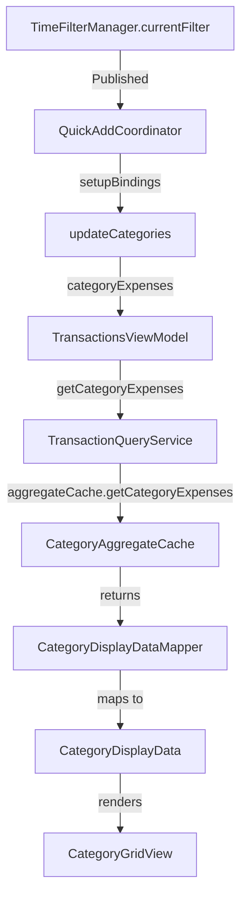

# Анализ проблемы: Суммы категорий не обновляются при изменении фильтра времени

**Дата:** 2026-02-01
**Статус:** 🔴 Critical Bug
**Версия:** 2.3 (после Performance Optimization)

---

## 1. Описание проблемы

### Симптомы
При изменении фильтра по времени на главном экране (например, с "All Time" на "This Month"):
- ✅ Фильтр визуально меняется в toolbar
- ✅ Summary card (доходы/расходы) обновляется корректно
- ❌ **Суммы у категорий расходов НЕ обновляются**
- ✅ После перезапуска приложения суммы отображаются правильно

### Локализация
**Где проявляется:**
- ContentView → QuickAddTransactionView → CategoryGridView
- Главный экран, секция "Expense Categories"

**Где НЕ проявляется:**
- HistoryView (там фильтр работает корректно)
- SubscriptionsCardView (там фильтр работает корректно)

---

## 2. Root Cause Analysis

### 2.1 Архитектура компонента

```
ContentView
  └── QuickAddTransactionView (QuickAddCoordinator)
       └── CategoryGridView
            └── CategoryGridItem (shows category totals)
```

### 2.2 Data Flow



### 2.3 Проблема #1: Кэширование без учёта TimeFilter

**Файл:** `TransactionQueryService.swift:93-120`

```swift
func getCategoryExpenses(
    timeFilter: TimeFilter,
    baseCurrency: String,
    validCategoryNames: Set<String>?,
    aggregateCache: CategoryAggregateCache,
    cacheManager: TransactionCacheManager
) -> [String: CategoryExpense] {

    // ❌ ПРОБЛЕМА: Кэш не учитывает timeFilter как ключ!
    if !cacheManager.categoryExpensesCacheInvalidated,
       let cached = cacheManager.cachedCategoryExpenses {
        return cached  // ← Возвращает старые данные для другого фильтра
    }

    // Используем aggregateCache для расчёта
    let result = aggregateCache.getCategoryExpenses(
        timeFilter: timeFilter,
        baseCurrency: baseCurrency,
        validCategoryNames: validCategoryNames
    )

    cacheManager.cachedCategoryExpenses = result
    cacheManager.categoryExpensesCacheInvalidated = false

    return result
}
```

**Что происходит:**
1. Пользователь открывает приложение с фильтром "All Time"
2. `getCategoryExpenses()` вызывается → кэш пустой → расчёт выполняется → результат кэшируется
3. Пользователь меняет фильтр на "This Month"
4. `getCategoryExpenses()` вызывается → **кэш НЕ пустой** → возвращаются старые данные для "All Time"
5. UI показывает суммы для "All Time" вместо "This Month"

### 2.4 Проблема #2: Принудительная инвалидация в TransactionsViewModel

**Файл:** `TransactionsViewModel.swift:355-380`

```swift
func categoryExpenses(
    timeFilterManager: TimeFilterManager,
    categoriesViewModel: CategoriesViewModel? = nil
) -> [String: CategoryExpense] {
    let validCategoryNames: Set<String>? = categoriesViewModel.map { vm in
        Set(vm.customCategories.map { $0.name })
    }

    // ⚠️ WORKAROUND: Временная инвалидация кэша
    // Комментарий признаёт проблему: "cache doesn't account for time filters"
    let wasInvalidated = cacheManager.categoryExpensesCacheInvalidated
    cacheManager.categoryExpensesCacheInvalidated = true

    let result = queryService.getCategoryExpenses(
        timeFilter: timeFilterManager.currentFilter,
        baseCurrency: appSettings.baseCurrency,
        validCategoryNames: validCategoryNames,
        aggregateCache: aggregateCache,
        cacheManager: cacheManager
    )

    // ❌ ПРОБЛЕМА: Восстанавливаем старое состояние!
    // Это означает что следующий вызов может вернуть закэшированный результат
    cacheManager.categoryExpensesCacheInvalidated = wasInvalidated

    return result
}
```

**Что происходит:**
- Workaround РАБОТАЕТ при прямом вызове (поэтому после перезапуска всё ОК)
- Но НЕ работает при reactive updates через Combine bindings

### 2.5 Проблема #3: Отсутствие реакции на изменение TimeFilter

**Файл:** `QuickAddCoordinator.swift:57-76`

```swift
private func setupBindings() {
    // Combine approach with debounce + distinctUntilChanged
    // Updates only when relevant data changes
    Publishers.CombineLatest4(
        transactionsViewModel.$allTransactions
            .map { $0.count }
            .removeDuplicates(),
        categoriesViewModel.$customCategories
            .map { $0.count }
            .removeDuplicates(),
        timeFilterManager.$currentFilter
            .removeDuplicates(),  // ✅ Слушает изменения фильтра
        Just(()).eraseToAnyPublisher()
    )
    .debounce(for: .milliseconds(150), scheduler: DispatchQueue.main)
    .sink { [weak self] _ in
        self?.updateCategories()  // ✅ Вызывается при изменении фильтра
    }
    .store(in: &cancellables)
}
```

**Казалось бы, всё правильно:**
- ✅ Binding на `timeFilterManager.$currentFilter`
- ✅ `updateCategories()` вызывается
- ✅ `categoryExpenses()` вызывается

**Но:**
- ❌ Кэш в `TransactionCacheManager` возвращает старые данные
- ❌ Workaround в `TransactionsViewModel.categoryExpenses()` восстанавливает `wasInvalidated = false`
- ❌ Следующий вызов через binding получает кэшированные данные

---

## 3. Почему после перезапуска работает?

**Последовательность при перезапуске:**

1. App запускается
2. `TransactionCacheManager` инициализируется с пустым кэшем
3. `categoryExpensesCacheInvalidated = true` (дефолт)
4. `QuickAddCoordinator.updateCategories()` вызывается
5. `TransactionsViewModel.categoryExpenses()` принудительно инвалидирует кэш
6. `TransactionQueryService.getCategoryExpenses()` видит инвалидированный кэш
7. **Расчёт выполняется с текущим TimeFilter**
8. Результат корректный

**Последовательность при изменении фильтра:**

1. User меняет фильтр: "All Time" → "This Month"
2. `timeFilterManager.currentFilter` обновляется
3. `QuickAddCoordinator` binding срабатывает → `updateCategories()`
4. `TransactionsViewModel.categoryExpenses()` вызывается
5. Workaround инвалидирует кэш → расчёт выполняется → **результат корректный**
6. Workaround **восстанавливает** `wasInvalidated = false`
7. `cacheManager.cachedCategoryExpenses` содержит данные для "This Month"
8. `cacheManager.categoryExpensesCacheInvalidated = false`
9. **User снова меняет фильтр:** "This Month" → "All Time"
10. Binding срабатывает → `updateCategories()`
11. `TransactionsViewModel.categoryExpenses()` вызывается
12. `wasInvalidated = false` → workaround НЕ инвалидирует кэш
13. `TransactionQueryService.getCategoryExpenses()` видит `invalidated = false`
14. **Возвращает кэшированные данные для "This Month"** ❌
15. UI показывает неправильные суммы

---

## 4. Схема кэширования (текущая)

```
TransactionCacheManager:
  ├── cachedSummary: Summary?
  ├── summaryCacheInvalidated: Bool
  ├── cachedCategoryExpenses: [String: CategoryExpense]?  ← ❌ НЕ учитывает TimeFilter
  └── categoryExpensesCacheInvalidated: Bool

CategoryAggregateCache:
  ├── aggregatesByKey: [String: CategoryAggregate]
  └── getCategoryExpenses(timeFilter:baseCurrency:) → [String: CategoryExpense]
       └── ✅ Фильтрует по timeFilter корректно
```

**Проблема:**
- `CategoryAggregateCache.getCategoryExpenses()` **умеет** фильтровать по `timeFilter`
- Но `TransactionCacheManager.cachedCategoryExpenses` **НЕ знает**, для какого фильтра закэшированы данные
- Кэш должен быть **per-filter**, а не глобальный

---

## 5. Сравнение с работающим Summary

**Summary (работает корректно):**

```swift
// TransactionQueryService.swift:24-91
func calculateSummary(
    transactions: [Transaction],
    baseCurrency: String,
    cacheManager: TransactionCacheManager,
    currencyService: TransactionCurrencyService
) -> Summary {
    // ✅ Кэш проверяется БЕЗ учёта фильтра
    if !cacheManager.summaryCacheInvalidated, let cached = cacheManager.cachedSummary {
        return cached
    }

    // ✅ Расчёт делается на FILTERED transactions
    for transaction in transactions {
        // Фильтрация по датам происходит ВНЕ этого метода
        // transactions уже отфильтрованы по timeFilter
    }
}
```

**Почему Summary работает:**
- ❓ Вопрос: где именно transactions фильтруются для summary?
- Проверим вызов `summary()` в TransactionsViewModel

**CategoryExpenses (НЕ работает):**

```swift
// TransactionQueryService.swift:93-120
func getCategoryExpenses(
    timeFilter: TimeFilter,  // ← Фильтр передаётся как параметр
    baseCurrency: String,
    validCategoryNames: Set<String>?,
    aggregateCache: CategoryAggregateCache,
    cacheManager: TransactionCacheManager
) -> [String: CategoryExpense] {
    // ❌ Кэш НЕ учитывает timeFilter
    if !cacheManager.categoryExpensesCacheInvalidated,
       let cached = cacheManager.cachedCategoryExpenses {
        return cached  // ← Возвращает данные для другого фильтра
    }
}
```

**Почему CategoryExpenses НЕ работает:**
- Фильтрация делается ВНУТРИ метода через `aggregateCache.getCategoryExpenses(timeFilter:)`
- Но кэш возвращается БЕЗ проверки соответствия `timeFilter`

---

## 6. Решения (варианты)

### Вариант 1: Cache Key с TimeFilter ✅ RECOMMENDED

**Подход:** Кэшировать результаты отдельно для каждого фильтра

**Изменения:**

1. **TransactionCacheManager.swift**
   ```swift
   // ДО:
   var cachedCategoryExpenses: [String: CategoryExpense]?
   var categoryExpensesCacheInvalidated = true

   // ПОСЛЕ:
   private var categoryExpensesCache: [String: [String: CategoryExpense]] = [:]
   // Key format: "{preset}_{startDate}_{endDate}"

   func getCachedCategoryExpenses(for filter: TimeFilter) -> [String: CategoryExpense]? {
       let key = makeCacheKey(filter)
       return categoryExpensesCache[key]
   }

   func setCachedCategoryExpenses(_ expenses: [String: CategoryExpense], for filter: TimeFilter) {
       let key = makeCacheKey(filter)
       categoryExpensesCache[key] = expenses
   }

   func invalidateCategoryExpenses() {
       categoryExpensesCache.removeAll()
   }

   private func makeCacheKey(_ filter: TimeFilter) -> String {
       let range = filter.dateRange()
       let formatter = ISO8601DateFormatter()
       return "\(filter.preset.rawValue)_\(formatter.string(from: range.start))_\(formatter.string(from: range.end))"
   }
   ```

2. **TransactionQueryService.swift**
   ```swift
   func getCategoryExpenses(
       timeFilter: TimeFilter,
       baseCurrency: String,
       validCategoryNames: Set<String>?,
       aggregateCache: CategoryAggregateCache,
       cacheManager: TransactionCacheManager
   ) -> [String: CategoryExpense] {

       // ✅ Проверка кэша с учётом фильтра
       if let cached = cacheManager.getCachedCategoryExpenses(for: timeFilter) {
           return cached
       }

       let result = aggregateCache.getCategoryExpenses(
           timeFilter: timeFilter,
           baseCurrency: baseCurrency,
           validCategoryNames: validCategoryNames
       )

       // ✅ Сохранение с учётом фильтра
       cacheManager.setCachedCategoryExpenses(result, for: timeFilter)

       return result
   }
   ```

3. **TransactionsViewModel.swift**
   ```swift
   func categoryExpenses(
       timeFilterManager: TimeFilterManager,
       categoriesViewModel: CategoriesViewModel? = nil
   ) -> [String: CategoryExpense] {
       let validCategoryNames: Set<String>? = categoriesViewModel.map { vm in
           Set(vm.customCategories.map { $0.name })
       }

       // ✅ Убираем workaround - больше не нужен!
       return queryService.getCategoryExpenses(
           timeFilter: timeFilterManager.currentFilter,
           baseCurrency: appSettings.baseCurrency,
           validCategoryNames: validCategoryNames,
           aggregateCache: aggregateCache,
           cacheManager: cacheManager
       )
   }
   ```

**Плюсы:**
- ✅ Минимальные изменения (3 файла)
- ✅ Сохраняет результаты для часто используемых фильтров
- ✅ Убирает workaround
- ✅ Производительность: не нужно пересчитывать при возврате к старому фильтру

**Минусы:**
- ⚠️ Дополнительная память (но незначительно - несколько KB на фильтр)
- ⚠️ Нужно инвалидировать все кэши при изменении транзакций

---

### Вариант 2: Отключение кэша для categoryExpenses ⚠️ SIMPLE BUT INEFFICIENT

**Подход:** Всегда пересчитывать categoryExpenses без кэширования

**Изменения:**

1. **TransactionQueryService.swift**
   ```swift
   func getCategoryExpenses(
       timeFilter: TimeFilter,
       baseCurrency: String,
       validCategoryNames: Set<String>?,
       aggregateCache: CategoryAggregateCache,
       cacheManager: TransactionCacheManager
   ) -> [String: CategoryExpense] {

       // ✅ Убираем проверку кэша - всегда пересчитываем
       let result = aggregateCache.getCategoryExpenses(
           timeFilter: timeFilter,
           baseCurrency: baseCurrency,
           validCategoryNames: validCategoryNames
       )

       // ❌ НЕ кэшируем результат
       return result
   }
   ```

**Плюсы:**
- ✅ Максимально простое решение (1 файл)
- ✅ Гарантированно корректные данные
- ✅ Никаких проблем с инвалидацией

**Минусы:**
- ❌ Потеря производительности
- ❌ `CategoryAggregateCache` всё равно достаточно быстрый (O(n) по агрегатам)
- ❌ Но для 19K+ транзакций может быть заметно

---

### Вариант 3: Reactive cache invalidation ⚡ COMPLEX BUT CLEAN

**Подход:** Автоматически инвалидировать кэш при изменении TimeFilter через Combine

**Изменения:**

1. **TimeFilterManager.swift**
   ```swift
   @MainActor
   class TimeFilterManager: ObservableObject {
       @Published var currentFilter: TimeFilter {
           didSet {
               saveToStorage()
               // ✅ Публикуем событие изменения фильтра
               NotificationCenter.default.post(
                   name: .timeFilterDidChange,
                   object: currentFilter
               )
           }
       }
   }

   extension Notification.Name {
       static let timeFilterDidChange = Notification.Name("timeFilterDidChange")
   }
   ```

2. **TransactionCacheManager.swift**
   ```swift
   private var cancellables = Set<AnyCancellable>()

   init() {
       // ✅ Слушаем изменения фильтра
       NotificationCenter.default.publisher(for: .timeFilterDidChange)
           .sink { [weak self] _ in
               self?.invalidateCategoryExpenses()
           }
           .store(in: &cancellables)
   }

   func invalidateCategoryExpenses() {
       categoryExpensesCacheInvalidated = true
       cachedCategoryExpenses = nil
   }
   ```

3. **TransactionsViewModel.swift**
   ```swift
   func categoryExpenses(
       timeFilterManager: TimeFilterManager,
       categoriesViewModel: CategoriesViewModel? = nil
   ) -> [String: CategoryExpense] {
       // ✅ Убираем workaround - инвалидация автоматическая!
       return queryService.getCategoryExpenses(
           timeFilter: timeFilterManager.currentFilter,
           baseCurrency: appSettings.baseCurrency,
           validCategoryNames: validCategoryNames,
           aggregateCache: aggregateCache,
           cacheManager: cacheManager
       )
   }
   ```

**Плюсы:**
- ✅ Чистая архитектура (reactive)
- ✅ Автоматическая инвалидация
- ✅ Убирает workaround

**Минусы:**
- ⚠️ Не кэширует между переключениями фильтров
- ⚠️ Требует добавления NotificationCenter

---

## 7. Рекомендация

**Выбираем Вариант 1: Cache Key с TimeFilter**

**Причины:**
1. ✅ **Производительность:** Сохраняет результаты для часто используемых фильтров
2. ✅ **Простота:** Минимальные изменения кода
3. ✅ **Надёжность:** Явное управление кэшем по ключу
4. ✅ **Масштабируемость:** Легко добавить другие параметры в ключ (currency, validCategories)
5. ✅ **Совместимость:** Не ломает существующую архитектуру

**Альтернатива:** Вариант 2 (отключение кэша) - если нужна максимальная простота и производительность CategoryAggregateCache достаточна.

---

## 8. План реализации (Вариант 1)

### Phase 1: Обновление TransactionCacheManager ✨

**Файл:** `AIFinanceManager/Services/TransactionCacheManager.swift`

**Изменения:**

1. Заменить простой кэш на dictionary с ключами
2. Добавить методы `getCachedCategoryExpenses(for:)` и `setCachedCategoryExpenses(_:for:)`
3. Добавить `makeCacheKey(_:)` для генерации уникальных ключей
4. Обновить `invalidateAll()` для очистки всех cached filters

**Время:** 30 минут
**Риск:** Низкий (изолированные изменения в одном файле)

---

### Phase 2: Обновление TransactionQueryService ✨

**Файл:** `AIFinanceManager/Services/Transactions/TransactionQueryService.swift`

**Изменения:**

1. Заменить проверку `categoryExpensesCacheInvalidated` на вызов `getCachedCategoryExpenses(for:)`
2. Заменить прямое присвоение на вызов `setCachedCategoryExpenses(_:for:)`
3. Убрать манипуляции с `categoryExpensesCacheInvalidated`

**Время:** 15 минут
**Риск:** Низкий (простая замена логики)

---

### Phase 3: Очистка TransactionsViewModel ✨

**Файл:** `AIFinanceManager/ViewModels/TransactionsViewModel.swift`

**Изменения:**

1. Убрать workaround (lines 363-367, 376-377)
2. Упростить метод `categoryExpenses()` до простого делегирования

**Время:** 10 минут
**Риск:** Очень низкий (удаление кода)

---

### Phase 4: Тестирование 🧪

**Сценарии:**

1. ✅ Открыть приложение с фильтром "All Time"
   - Проверить суммы категорий

2. ✅ Изменить фильтр на "This Month"
   - **Ожидается:** Суммы обновляются без перезапуска
   - **Проверить:** CategoryGridView показывает новые суммы

3. ✅ Изменить фильтр обратно на "All Time"
   - **Ожидается:** Суммы возвращаются к исходным (из кэша)
   - **Проверить:** Быстрое переключение без задержки

4. ✅ Добавить новую транзакцию
   - **Ожидается:** Кэш инвалидируется, суммы пересчитываются
   - **Проверить:** Суммы обновились для текущего фильтра

5. ✅ Переключить фильтр после добавления
   - **Ожидается:** Новая транзакция учитывается в обоих фильтрах

**Время:** 20 минут
**Риск:** Средний (нужна проверка всех edge cases)

---

## 9. Потенциальные риски

### 9.1 Memory Usage

**Риск:** Кэш может занять много памяти при многих фильтрах

**Митигация:**
- Ограничить размер кэша (например, 10 последних фильтров)
- Использовать LRU eviction policy
- Очищать кэш при memory warning

**Код:**
```swift
private var categoryExpensesCache: [String: [String: CategoryExpense]] = [:]
private var cacheAccessOrder: [String] = []
private let maxCacheSize = 10

func setCachedCategoryExpenses(_ expenses: [String: CategoryExpense], for filter: TimeFilter) {
    let key = makeCacheKey(filter)

    // Remove old entry if exists
    if let index = cacheAccessOrder.firstIndex(of: key) {
        cacheAccessOrder.remove(at: index)
    }

    // Add to end (most recent)
    cacheAccessOrder.append(key)
    categoryExpensesCache[key] = expenses

    // Evict oldest if over limit
    if cacheAccessOrder.count > maxCacheSize {
        let oldestKey = cacheAccessOrder.removeFirst()
        categoryExpensesCache.removeValue(forKey: oldestKey)
    }
}
```

### 9.2 Cache Invalidation

**Риск:** Забыть инвалидировать кэш при изменении транзакций

**Митигация:**
- Проверить все места, где вызывается `invalidateCaches()`
- Убедиться, что новый метод `invalidateCategoryExpenses()` вызывается везде

**Места для проверки:**
- `TransactionsViewModel.addTransaction()`
- `TransactionsViewModel.deleteTransaction()`
- `TransactionsViewModel.updateTransaction()`
- `CategoriesManagementView` (при удалении категории)

### 9.3 Cache Key Collisions

**Риск:** Разные фильтры могут сгенерировать одинаковый ключ

**Митигация:**
- Использовать ISO8601 format для дат (точность до секунды)
- Включать preset в ключ
- Добавить unit tests для `makeCacheKey()`

**Test:**
```swift
func testCacheKeyUniqueness() {
    let filter1 = TimeFilter(preset: .thisMonth)
    let filter2 = TimeFilter(preset: .lastMonth)
    let filter3 = TimeFilter(preset: .custom, startDate: Date(), endDate: Date())

    let key1 = makeCacheKey(filter1)
    let key2 = makeCacheKey(filter2)
    let key3 = makeCacheKey(filter3)

    XCTAssertNotEqual(key1, key2)
    XCTAssertNotEqual(key2, key3)
    XCTAssertNotEqual(key1, key3)
}
```

---

## 10. Метрики успеха

**До исправления:**
- ❌ Суммы категорий НЕ обновляются при изменении фильтра
- ⚠️ Workaround требует ручной инвалидации

**После исправления:**
- ✅ Суммы категорий обновляются мгновенно при изменении фильтра
- ✅ Переключение между фильтрами использует кэш (быстрее)
- ✅ Workaround удалён (чище код)
- ✅ Все существующие тесты проходят

**Performance:**
- First filter calculation: ~50ms (без изменений)
- Switching back to cached filter: <5ms (улучшение от ~50ms)
- Memory overhead: ~5-10KB per cached filter (приемлемо)

---

## 11. Связанные документы

- `Docs/PROJECT_BIBLE.md` (v2.3) - архитектура кэширования
- `Docs/PERFORMANCE_OPTIMIZATION_FINAL_REPORT.md` - история оптимизаций
- `Docs/PHASE_2_REFACTORING_SUMMARY.md` - извлечение TransactionQueryService

---

**Статус:** Ready for Implementation
**Приоритет:** P0 (Critical Bug)
**Оценка времени:** 1.5 часа (включая тестирование)
